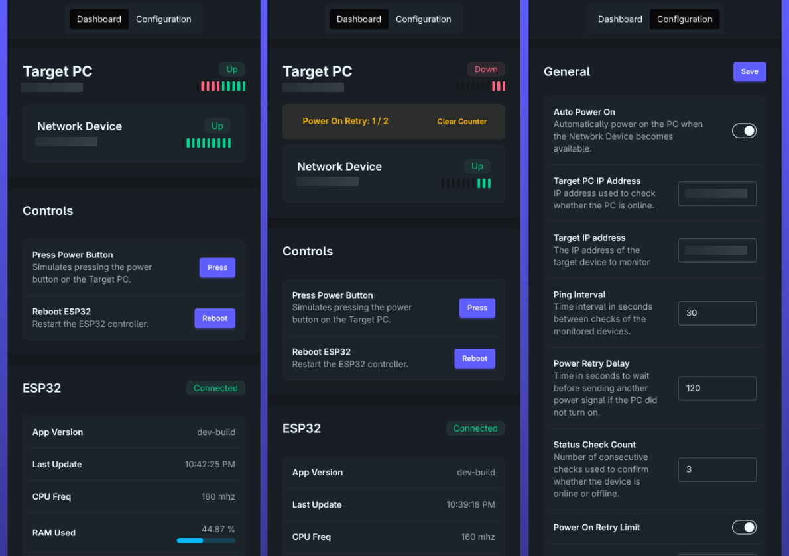
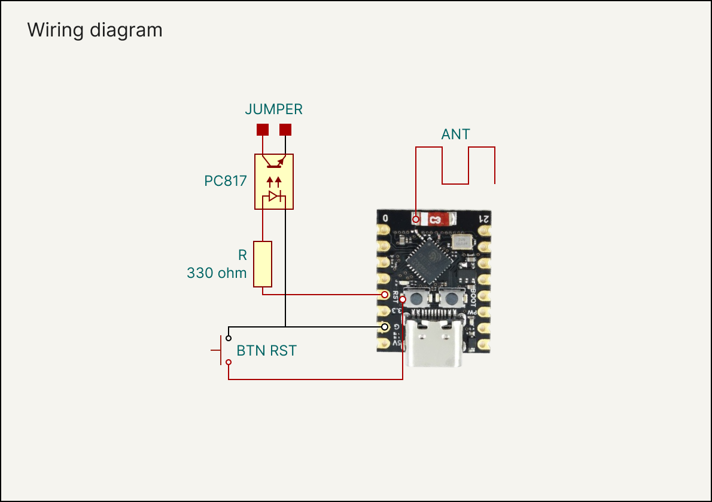
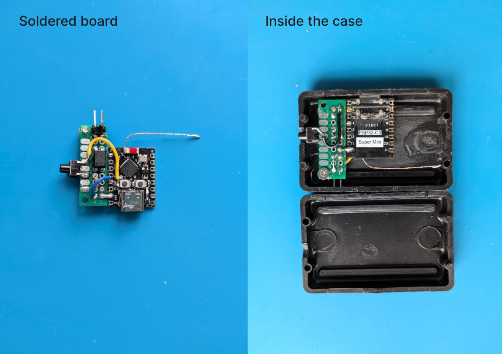
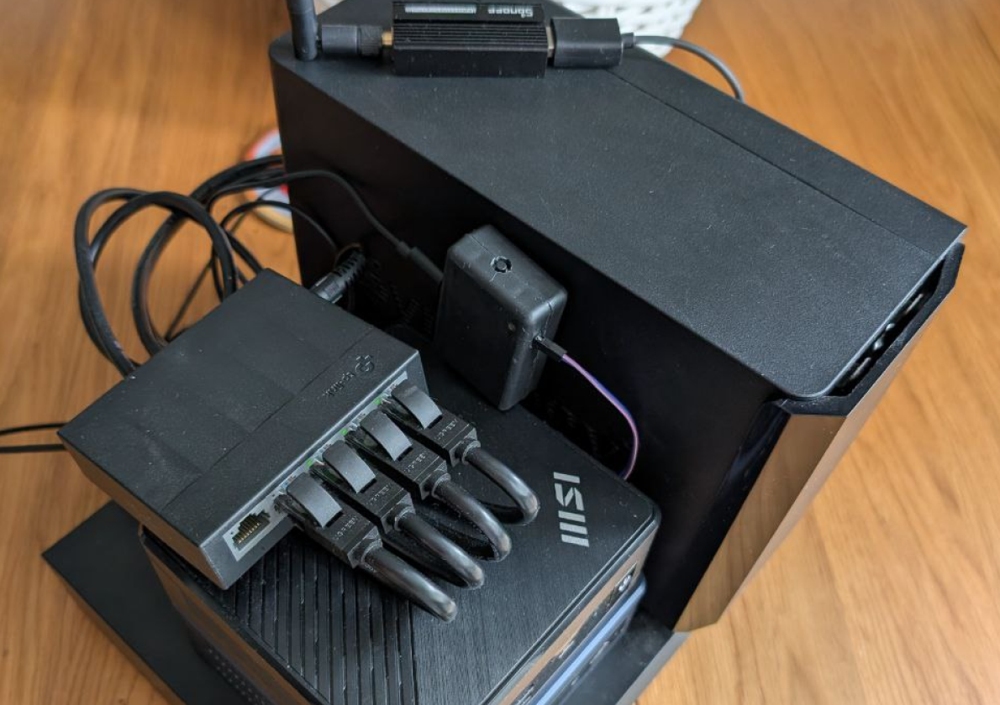

# ESP32 Smart PC Power Button

An ESP32-based device that simulates a PC power button, allowing
remote control and automatic startup after power outages.

# Features

-   Remote PC power control
-   Automatic wake-up based on network device monitoring
-   Web interface for configuration and management
-   REST API for automation and integrations


## Table of Contents

- [ESP32 Smart PC Power Button](#esp32-smart-pc-power-button)
- [Features](#features)
  - [Table of Contents](#table-of-contents)
- [How It Works](#how-it-works)
- [Hardware Requirements](#hardware-requirements)
- [Wiring Diagram](#wiring-diagram)
- [Software Stack](#software-stack)
- [Quick Start](#quick-start)
- [Installation](#installation)
  - [1. Flash MicroPython](#1-flash-micropython)
  - [2. Build the Web UI](#2-build-the-web-ui)
  - [3. Upload Firmware to ESP32](#3-upload-firmware-to-esp32)
  - [4. Configure Settings](#4-configure-settings)
  - [5. Run the Device](#5-run-the-device)
- [REST API](#rest-api)
- [Home Assistant Integration Example](#home-assistant-integration-example)
- [Future Improvements](#future-improvements)
- [License](#license)


# How It Works

The ESP32 connects to your local network and monitors selected
devices (any wifi device in network).

When **Auto Power On** is enabled:

1. The ESP32 periodically checks whether the monitored device responds
   to network requests.
2. If the device becomes reachable while the PC is still off, the ESP32
   triggers the motherboard **power button signal** using an optocoupler.
3. The PC powers on automatically.

This allows the computer to **recover automatically after power outages** when restoring the last state and WoL don't work.

When **Auto Power On** is disabled, the device behaves like a simple
**Wi-Fi-controlled power button** that can be triggered through the
Web UI or REST API.




# Hardware Requirements

-   ESP32‑C3 SuperMini (or compatible ESP32 board)
-   PC817 optocoupler
-   330Ω resistor
-   Jumper wires
-   Optional breakout board
-   Optional enclosure

> [!NOTE] 
> Some ESP32‑C3 SuperMini boards have **weak Wi‑Fi signal stability**
because the antenna is placed very close to other components.
> A simple fix is to solder a **\~3 cm copper wire** to the antenna pad
indicated in the diagram.
>
> Some boards also lack an exposed **reset pin**, so you may need to
solder directly to the reset button pads.


# Wiring Diagram

The full wiring diagram and assembly example are shown below.







> The ESP32 controls the PC power button using a **PC817 optocoupler**,
which provides electrical isolation and safely simulates pressing the
physical power button on the motherboard.


# Software Stack

-   **MicroPython** -- ESP32 firmware
-   **SolidJS** -- Web interface
-   **Node.js** -- frontend build system


# Quick Start

1. Flash **MicroPython** to the ESP32-C3.
2. Build the frontend.
3. Upload the contents of the `esp32` directory to the device.
4. Edit `esp32/settings.py` and set your Wi-Fi credentials.
5. Restart the ESP32.
6. Open the ESP32 IP address in your browser to access the **Web UI**.

The device is now ready to control your PC power button.


# Installation

## 1. Flash MicroPython

Download firmware for ESP32‑C3:

https://micropython.org/download/ESP32_GENERIC_C3/

You can flash it using **esptool** or:

https://adafruit.github.io/Adafruit_WebSerial_ESPTool/


## 2. Build the Web UI

Navigate to the frontend directory:

``` bash
cd frontend
```

Install dependencies:

``` bash
npm install
```

Build the frontend:

``` bash
npm run build
```

The production build will be placed in:

    esp32/static


## 3. Upload Firmware to ESP32

Upload the contents of the `esp32` directory to the device.

A convenient method is using **Thonny IDE**:

https://thonny.org/

Setup guide:

https://randomnerdtutorials.com/getting-started-thonny-micropython-python-ide-esp32-esp8266/


## 4. Configure Settings

Edit `settings.py` before running the device.

``` python
# esp32/settings.py

# GPIO pin connected to optocoupler
s_pin = 4

# WiFi credentials
ssid = "YOUR_WIFI"
password = "YOUR_PASSWORD"
```


## 5. Run the Device

After uploading the files, restart the ESP32.

The device will connect to Wi‑Fi and print the assigned **IP address**
in the serial console or find the device by its hostname **esp32-pc-button**. 

Open the address in your browser to access the **Web UI**.


# REST API

Access the API through the IP address assigned to the ESP32.

  | Method | Endpoint           | Description                  |
  | ------ | ------------------ | ---------------------------- |
  | GET    | `/api/config`      | Get current configuration    |
  | PUT    | `/api/config`      | Update configuration         |
  | GET    | `/api/signal`      | Trigger power signal         |
  | GET    | `/api/ping_status` | Get device monitoring status |
  | GET    | `/api/sys/reboot`  | Reboot ESP32                 |
  | GET    | `/api/sys/info`    | Get system information       |


# Home Assistant Integration Example

Example REST command configuration:

``` yaml
rest_command:
  pc_power_on:
    url: "http://ESP_IP/api/signal"
    method: GET
```

Example button:

``` yaml
button:
  - platform: template
    buttons:
      pc_power_button:
        friendly_name: "Power PC"
        press:
          service: rest_command.pc_power_on
```
# Future Improvements

Planned ideas and possible future enhancements:

- Wi-Fi setup mode (initial configuration through a temporary access point)
- Wi-Fi reset functionality to clear saved credentials and re-enter setup mode
- Add the ability to configure multiple devices for control.
- Allow monitoring **multiple network devices** simultaneously
- Add **MQTT support** for deeper Home Assistant integration
- Improve **network monitoring logic** (custom intervals, retries, thresholds)

# License

This project is licensed under the **MIT License**.

See the [LICENSE](LICENSE) file for details.